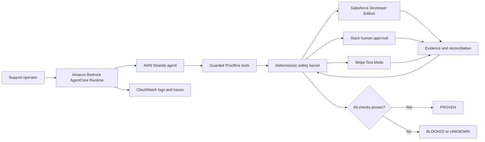

# Proofline Strands

> **AI can propose. Proofline makes it prove.**

Proofline is an AWS Strands accountability agent for consequential business operations. It clears the busywork of coordinating a customer refund across **Salesforce**, **Slack**, and **Stripe Test Mode**, while reserving the judgment call for a human and refusing to report success until every system independently agrees.

- **Agents for Humans track:** Pro Agents
- **Built by:** Akinola Olayinka, solo
- **Framework:** [AWS Strands Agents SDK for TypeScript](https://strandsagents.com/docs/user-guide/quickstart/typescript/)

## Demo

The public YouTube/Vimeo demo will be linked here before submission. It includes both the pitch and an end-to-end run against official vendor test/developer environments.

## The human problem

Support teams lose time moving between a CRM, chat, and payment processor. Automating that work creates a worse risk: an API can commit a refund and then lose its response. A naive agent retries and may duplicate the action; an optimistic agent claims success it cannot prove.

Proofline gives the model useful agency without giving it authority it cannot safely hold:

- **Strands reasons and coordinates.** It extracts intent and selects purpose-built tools.
- **A human decides.** Slack approval is bound to the exact amount, payment, case revision, currency, and reason.
- **The kernel executes once.** Stripe receives a deterministic idempotency key.
- **The systems prove the outcome.** Stripe and Salesforce are read back before `PROVEN` is reachable.

## Architecture



The Strands layer has five narrow tools:

| Strands tool | Capability | Safety boundary |
|---|---|---|
| `verify_connections` | Read official service identities | Read-only |
| `seed_official_test_records` | Create safe demo records | Stripe Test Mode and Salesforce Developer Edition only |
| `request_refund_approval` | Bind an action and ask in Slack | Cannot execute a refund |
| `check_approval_and_execute` | Continue an approved run | Kernel rechecks approval and CRM freshness |
| `get_proof_evidence` | Read state and evidence | Cannot change external systems |

The model has no tool that directly calls Stripe. The only execution path independently verifies the Slack receipt and rejects a stale Salesforce revision before creating a refund.

## The failure worth seeing

Enable **Reliability lab** during the demo. Proofline lets Stripe commit the Test Mode refund, then deliberately discards the response.

1. The run enters `UNKNOWN`; the agent withholds success.
2. The kernel searches Stripe using immutable run metadata instead of retrying.
3. It finds and reads back the already-committed refund.
4. It records the receipt in Salesforce and reads that record back.
5. Only three independent checks can produce `VERIFIED / PROVEN`.

The test suite asserts that the ambiguous-response path makes exactly **one** Stripe mutation attempt.

## State machine

```text
PREPARING
  -> WAITING_APPROVAL
  -> APPROVED
  -> EXECUTING
       -> VERIFYING -> VERIFIED
       -> UNKNOWN -> RECONCILING -> VERIFYING

Any violated invariant exits to BLOCKED or FAILED.
Terminal states cannot transition.
```

## Run locally

Requirements: Node.js 20+, an AWS account with Bedrock model access, and official test/developer accounts for Slack, Stripe, and Salesforce.

```bash
npm install
cp .env.example .env
# Configure AWS credentials and official test/developer integrations.
npm start
```

Open <http://localhost:8787/setup.html> to store integration credentials in the local gitignored vault, then open <http://localhost:8787>.

Strands uses Amazon Bedrock by default. Configure credentials with the AWS CLI, an IAM role, or `AWS_BEARER_TOKEN_BEDROCK`. Set `STRANDS_MODEL_ID` only when overriding the SDK default model.

## AgentCore-ready contract

The same server implements the Amazon Bedrock AgentCore Runtime HTTP contract:

- `GET /ping` — runtime health
- `POST /invocations` — invoke the Strands agent with `{ "prompt": "..." }`

Build the small Node 22 deployment artifact:

```bash
npm run build:agentcore
```

Use `dist/agentcore.js` as the CodeZip entry point and include `dist/package.json` so the bundled runtime loads as an ES module. Configure `HOST=0.0.0.0` plus `PORT=8080`. See [AWS's Node.js direct-deployment guide](https://docs.aws.amazon.com/bedrock-agentcore/latest/devguide/runtime-get-started-code-deploy-node.html) and [the deployment runbook](./docs/AGENTCORE.md).

## Test the claims

```bash
npm run check
```

The tests cover canonical digests, parameter tampering, illegal transitions, incomplete evidence, stale Salesforce revisions, Strands tool boundaries, and reconciliation after a lost Stripe response.

## Repository map

```text
src/strands-agent.js         Strands agents, structured intent, and guarded tools
src/agent.js                 deterministic orchestration and evidence gates
src/domain.js                canonical digest and guarded state machine
src/integrations/            Slack, Stripe, and Salesforce adapters
public/                      live proof console
test/                        executable safety and Strands boundary tests
docs/                        integration and demo runbooks
config/                      Slack application manifest
```

## Build provenance

This Strands edition is a new Agents for Humans project built during the competition submission period. It reuses entrant-authored safety-kernel and integration components from the original Proofline prototype, which was created on September 13, 2026—also inside this competition's submission window. The reused foundation and all new work are disclosed in [BUILD_PROVENANCE.md](./BUILD_PROVENANCE.md).

No repository history or timestamps were altered to conceal prior work.

## License

[MIT](./LICENSE)
